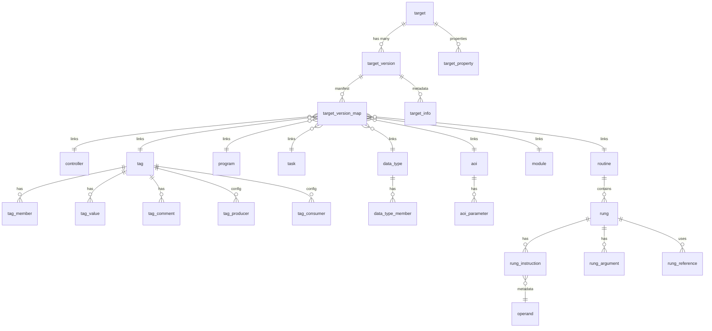

# LogixDb

An ETL tool for managing and automating ingestion of Rockwell Automation Logix Designer ACD/L5X project files
into a relational SQL database schema, enabling workflows such as project analysis, validation,
documentation, change tracking, and versioning.

## Motivation

Analyzing and extracting data from Rockwell PLC projects is often slow and manual. Without opening Studio 5000, there is
no straightforward way to centrally manage or review code across multiple projects. For system integrators and
developers, tasks like comparing configurations, validating logic versions, or bulk-extracting data remain difficult.

LogixDb was built to make PLC code analysis and data extraction developer-friendly. By parsing PLC files into a
structured SQL schema, it enables developers and controls engineers to leverage the power of SQL to write custom
queries, views, and procedures for project analysis, validation, and documentation.

## Core Concepts

LogixDb uses a **Content-Addressable Deduplication** model to efficiently store PLC project data. Instead of storing a
full copy of every project version, it deduplicates components (Tags, Rungs, Programs, etc.) globally across the entire
database.

* **Targets**: Represents a unique PLC (e.g., `PLC://Main_Controller`)
    * These could be partial exports as well (e.g., Programs, UDTs, etc.).
* **Versions**: Every time a project is imported, a new version is created. This version acts as a snapshot in time.
* **Deduplication**: When a new version is imported, LogixDb hashes each component. If an identical component already
  exists in the database, the new version simply points to the existing record.
* **Manifest (`target_version_map`)**: A lean table that maps each project version to its constituent components. This
  allows for rapid reconstruction of any historical version.
* **Forward-Only**: The database is designed for continuous ingestion and long-term history. Metadata can be pruned, but
  the core deduplicated entity data remains for cross-reference.

## Overview

LogixDb currently offers a few tools for users to work with.

### CLI

Interactive command-line tool for managing database operations. Use it for importing L5X/ACD files, exporting targets,
and performing database maintenance. See the table below for a complete list of available commands.

| Command       | Description                                                                                                                            |
|:--------------|:---------------------------------------------------------------------------------------------------------------------------------------|
| **`migrate`** | Runs database migrations to ensure the schema is up to date. Supports selective table creation via `--components`.                     |
| **`import`**  | Ingests an L5X or ACD file into the database. This command automatically deduplicates components and updates the `target_version_map`. |
| **`sync`**    | Connects to an online PLC to upload live tag values and creates a new version in the database.                                         |
| **`list`**    | Lists all registered targets and their available versions.                                                                             |
| **`export`**  | Exports a specific version or target back to an L5X file.                                                                              |
| **`prune`**   | Removes metadata for a target that is no longer needed.                                                                                |
| **`purge`**   | Permanently deletes a target and its entire history.                                                                                   |
| **`drop`**    | Drops the entire database schema and all associated data.                                                                              |

#### Example Usage

The CLI requires a connection string using the `-c` or `--connection` option. For **SQLite**, this is a file path.
For **SQL Server**, use the format `DatabaseName@ServerHost`.

**Run migrations to ensure the latest database schema**:

```powershell
logixdb migrate -c "C:\Data\Logix.db"
```

#### Selective Component Migrations

By default, the `migrate` command creates all necessary tables for a full Logix project. However, you can use the
`--components` option to selectively create only specific sets of tables. This is useful for minimizing database size if
you only need a subset of the data (e.g., only Tags or only Logic).

The available options are defined by the `ComponentOptions` flags:

| Flag         | Value | Description                                           |
|--------------|-------|-------------------------------------------------------|
| `None`       | 0     | No component tables are created.                      |
| `Controller` | 1     | Includes all controller-related tables.               |
| `DataType`   | 2     | Includes all user-defined and system data types.      |
| `Aoi`        | 4     | Includes all Add-On Instruction (AOI) tables.         |
| `Module`     | 8     | Includes all IO and module configuration tables.      |
| `Tag`        | 16    | Includes all controller and program tags.             |
| `Logic`      | 32    | Includes all program, routine, and rung logic tables. |
| `Qa`         | 64    | Includes all QA and validation schema tables.         |
| `All`        | 127   | Includes all tables (Default).                        |

**Example: Migrate only Tag and Logic tables**

You can combine flags by passing a comma-separated list or the sum of their values:

```powershell
# Using names (recommended for clarity)
logixdb migrate -c "C:\Data\Logix.db" --components "Tag, Logic"

# Using bitwise sum (16 + 32 = 48)
logixdb migrate -c "C:\Data\Logix.db" --components 48
```

**Import an L5X file (SQLite)**:

```powershell
logixdb import -c "C:\Data\Logix.db" -s "C:\Projects\MyProject.L5X" -t "PLC://Main_Controller"
```

**List all versions for a specific target (SQL Server)**:

```powershell
logixdb list -c "LogixDb@localhost" -t "PLC://Main_Controller"
```

**Export a specific version to a file**:

```powershell
logixdb export -c "LogixDb@localhost" -t "PLC://Main_Controller" -v 1 -o "C:\Exports\Backup_v1.L5X"
```

### Ingestion API Endpoint

The Windows service hosts a lightweight REST API for automated project ingestion. This allows external tools,
CI/CD pipelines, or scripts to upload PLC files to the service, which then processes and ingests them into the
configured database in the background.

#### Endpoint

| Path      | Method | Content-Type          | Description                                                     |
|-----------|--------|-----------------------|-----------------------------------------------------------------|
| `/ingest` | `POST` | `multipart/form-data` | Uploads an L5X or ACD file for background parsing and ingestion |
| `/health` | `GET`  | `application/json`    | Returns the current service status and system time              |

#### Request

The `/ingest` endpoint expects a `multipart/form-data` request with a single `file` field containing the L5X or ACD
source file.

Custom metadata can be associated with an upload by including request headers prefixed with `Logix-`. These headers
will be extracted and stored alongside the target metadata.

Example: `Logix-Target: PLC_A` or `Logix-Environment: Production`.

#### Response

Upon a successful upload, the API returns a `202 Accepted` response with the following JSON structure:

```json
{
  "traceId": "guid-of-upload",
  "received": "ProjectName.ACD",
  "status": "Queued"
}
```

#### Example Usage

Upload a file using `curl`:

```powershell
curl -X POST http://localhost:5000/ingest `
  -F "file=@C:\Projects\MyProject.acd" `
  -H "Logix-Target: MyTarget"
```

### FTAC Monitor Service

The Windows service includes an optional FTAC (FactoryTalk AssetCentre) monitoring feature. When enabled, this service
automatically monitors a FactoryTalk AssetCentre database for new versions of `.ACD` files, downloads them, and
ingests them into the configured LogixDb.

#### How it Works

1. **Polling**: The `FtacMonitorService` monitors the AssetCentre database for new asset versions.
2. **Download**: When a new version is detected, the `FtacDownloadService` retrieves the file from the database.
3. **Ingestion**: The downloaded file is placed in the configured `DropPath` and queued for background ingestion.

#### Configuration

To configure the Windows service, update the `LogixConfig` section in `appsettings.json`:

| Setting          | Type       | Default | Description                                                                                                       |
|------------------|------------|---------|-------------------------------------------------------------------------------------------------------------------|
| `DbConnection`   | `String`   | `null`  | The connection string for the LogixDb database (SQLite file path or `DatabaseName@ServerHost` for SQL Server).    |
| `DropPath`       | `String`   | `null`  | The local directory where `.L5X` or `.ACD` files are placed for background ingestion.                             |
| `AcdConverter`   | `String`   | `null`  | Path to a custom CLI tool for converting ACD to L5X. Expected contract: `convert -i <input> -o <output> --force`. |
| `FtacMonitor`    | `Boolean`  | `false` | Enables or disables the FTAC monitoring background services.                                                      |
| `FtacConnection` | `String`   | `null`  | Optional SQL connection string override for the AssetCentre database.                                             |
| `FtacFilters`    | `String[]` | `[]`    | A list of asset name filters (wildcards supported) to limit which assets are monitored.                           |

> [!IMPORTANT]
> The service account running LogixDb must have `SELECT` and `EXECUTE` permissions on the FactoryTalk AssetCentre
> database. By default, the service assumes a local AssetCentre installation with Windows Authentication.

#### Example Configuration

```json
{
  "LogixConfig": {
    "DbConnection": "LogixDb@localhost",
    "DropPath": "C:\\ProgramData\\LogixDb\\Uploads",
    "AcdConverter": "C:\\Tools\\AcdToL5x.exe",
    "FtacMonitor": true,
    "FtacConnection": "Data Source=RemoteServer;Initial Catalog=AssetCentre;Integrated Security=SSPI;",
    "FtacFilters": [
      "Area1*",
      "Line2*",
      "!*Backup*"
    ]
  }
}
```

#### FTAC Asset Name Filtering

The `FtacFilters` configuration allows you to control which ACD files are processed from the FactoryTalk AssetCentre
database. It supports standard wildcards and both **Whitelisting** (inclusion) and **Blacklisting** (exclusion).

#### Supported Wildcards

* `*`: Matches **zero or more** characters (e.g., `*Test*` matches `Test.ACD`, `NewTest.ACD`, and `Test_Final.ACD`).
* `?`: Matches **exactly one** character (e.g., `Line?_Prog` matches `Line1_Prog` and `LineA_Prog`, but not
  `Line12_Prog`).

#### Filtering Rules

1. **Blacklists**: Any filter starting with `!` is a blacklist. If an asset name matches **any** blacklist pattern, it
   is excluded.
2. **Whitelists**: Filters without a `!` prefix are whitelists. If any whitelist patterns are defined, the asset name
   must match **at least one** of them to be included.
3. **Default**: If no filters are provided, all `.ACD` files are processed.

#### Example Filter Configurations

| Filter Pattern                                 | Description                                                                  |
|------------------------------------------------|------------------------------------------------------------------------------|
| `Area1*`                                       | Only process assets that start with "Area1"                                  |
| `Line1*`, `Line2*`, `!*Backup*`                | Process assets from Line 1 or 2, but exclude anything containing "Backup"    |
| `!Test*`, `!*TEMP.ACD`                         | Process all assets except those starting with "Test" or ending in "TEMP.ACD" |
| `Unit?.ACD`                                    | Match "Unit1.ACD" through "Unit9.ACD", but not "Unit10.ACD"                  |
| `*Main*`, `*Safety*`, `!Area51*`, `!*Sandbox*` | Include "Main" or "Safety" assets, but exclude "Area51" and "Sandbox" assets |

## Database Providers

This tool currently supports both Microsoft SQL Server and SQLite database providers.

| Provider       | Description                                                                                                                                                                                                                                                                             |
|----------------|-----------------------------------------------------------------------------------------------------------------------------------------------------------------------------------------------------------------------------------------------------------------------------------------|
| **SQLite**     | Ideal for single-developer or quick analysis scenarios. Free and open source with no additional server-side software required. Developers can quickly transform PLC projects into SQLite databases on the fly. Generated database files can be queried using any preferred client.      |
| **SQL Server** | Designed for team environments, especially those using version control systems like FTAC, Git, or SVN. Enables centralized data management and supports advanced features such as stored procedures, triggers, tSQLt, and custom tooling for enhanced collaboration and data integrity. |

This tool enables automated ingestion of L5X and ACD files into either database provider.

### QA & Validation (SQL Server Only)

For SQL Server, LogixDb includes a dedicated `qa` schema designed for automated project validation. This allows users to
define and run custom validation rules against ingested PLC projects.

| Object                      | Type        | Description                                                                              |
|-----------------------------|-------------|------------------------------------------------------------------------------------------|
| `qa.validations`            | View        | Lists all registered validation procedures and their metadata.                            |
| `qa.run_validation`         | Procedure   | Executes a specific validation procedure for a given target version.                     |
| `qa.run_validations`        | Procedure   | Executes all applicable validations for a given target version.                          |
| `qa.rerun_validations`      | Procedure   | Reruns validations for a specific run ID, useful for debugging or re-evaluating results. |
| `qa.get_variable_as_bit`    | Procedure   | Helper to retrieve a tag value as a bit for validation logic.                            |
| `qa.get_variable_as_real`   | Procedure   | Helper to retrieve a tag value as a real for validation logic.                           |
| `qa.get_variable_as_date`   | Procedure   | Helper to retrieve a tag value as a date for validation logic.                           |

These tools enable developers to build robust automated testing pipelines for their PLC code, ensuring compliance with
coding standards and functional requirements before deployment.

## ACD File Conversion

LogixDb uses the Rockwell Logix Designer SDK to convert `.ACD` files into `.L5X` so they can be parsed and
ingested. By default, the service uses the SDK on the local machine to perform this conversion. Since spinning up
a headless Studio 5000 instance to save as `.L5X` is a resource-intensive process, this task is handled by the
Windows service in the background as new files are uploaded or detected in version control.

### Custom Converter Executable

To avoid software redistribution and provide flexibility, LogixDb allows users to specify a custom command-line
executable for `.ACD` conversion. If a custom converter is specified, the service will call it instead of the default
SDK-based converter.

The custom converter must support the following CLI arguments:
`convert -i <input_path> -o <output_path> --force`

> [!NOTE]
> This capability is provided to allow users to integrate their own conversion tools and to ensure that LogixDb
> does not redistribute proprietary Rockwell Automation software.

## Installation

LogixDb is distributed as a single ZIP package containing self-contained executables for both the CLI tool and the
Windows service. No .NET runtime installation is required.

### Prerequisites

- Windows 10 or later
- PowerShell 5.1 or later (for automated installation)
- Rockwell Automation Software (Optional or use case dependent)
    - **Logix Designer / Studio 5000**: Required on the machine performing conversions if processing `.ACD` files.
    - **Rockwell Logix Designer SDK**: Used for `.ACD` file conversion by default.
    - **FactoryTalk AssetCentre**: Required if using the `FtacMonitorService` to automatically pull files from an
      AssetCentre database. This could be installed on remote machine as well.

### Setup

1. Download the latest release ZIP from [releases](https://github.com/tnunnink/LogixDb/releases)
2. Extract the ZIP to a temporary location
3. Open PowerShell as an Administrator
4. Navigate to the extracted directory
5. Unblock the PowerShell script:
   ```powershell
   Unblock-File -Path .\Setup.ps1
   ```
6. Run the installation script:
   ```powershell
   .\Setup.ps1
   ```

The setup script automates the following steps:

- **Service Deployment**: Stops any existing `LogixDb` service and deploys files to `C:\Program Files\LogixDb`.
- **SQL Permissions**: Checks for a local FactoryTalk AssetCentre database and seeds the necessary `SELECT` and`EXECUTE`
  permissions for the `NT SERVICE\LogixDb` service account.
- **Service Configuration**: Creates or updates the `LogixDb` Windows Service to run automatically.
- **System PATH**: Adds the installation directory to the system `PATH`, making the `logixdb` CLI available globally.
- **Service Startup**: Starts the `LogixDb` service to begin monitoring or hosting the Ingestion API.

> [!IMPORTANT]
> The setup script does **not** automatically migrate existing LogixDb databases. If you are upgrading or
> reinstalling, you must manually run the `logixdb migrate` command to ensure the schema is up to date
> before re-enabling or relying on the service. Check the Windows Event Viewer for errors to ensure no issues with
> database connection/validation.

### Service Management

The `LogixDb` service runs as a Windows Service. You can manage its lifecycle using the following PowerShell commands as
an Administrator:

```powershell
# View service status
Get-Service -Name LogixDb

# Restart the service (required after appsettings.json changes)
Restart-Service -Name LogixDb -Force

# View service properties and start type
Get-Service -Name LogixDb | Select-Object -Property Name, Status, StartType
```

By default, the service is installed in `C:\Program Files\LogixDb` and runs under the `NT SERVICE\LogixDb` account. If
you need to access remote network shares or specific AssetCentre instances, you may need to change the service account
via `services.msc`.

### Logging & Diagnostics

Both the CLI and the Windows Service provide detailed logging.

* **Service Logs**: The service writes events to the **Windows Event Log** under the "Application" source.
* **Verbosity**: To increase logging detail, update the `LogLevel` in `appsettings.json`:
  ```json
  "Logging": {
    "LogLevel": {
      "Default": "Debug",
      "Microsoft": "Warning"
    }
  }
  ```
* **Health Check**: You can verify the service is running by visiting `http://localhost:5000/health` in your browser.

## Database Schema

LogixDb uses a **Content-Addressable Deduplication** model to store PLC project data. This architecture is designed to
scale to thousands of project versions by minimizing redundancy and optimizing for high-performance cross-project
analysis.

### Architecture Motivation

Storing full copies of PLC projects (which can be tens of megabytes of XML/L5X) for every version quickly leads to
database bloat. LogixDb solves this by treating every component—Tags, Rungs, Programs—as immutable snapshots identified
by their content.

1. **Storage Efficiency**: If a Tag or Rung doesn't change between versions, it is stored exactly once in the database.
2. **Performance**: Relationships use stable relational links (`long` IDs) and natural keys (`program_name`, `tag_name`)
   to enable fast joins without the "ripple effect" of changing GUIDs.
3. **Scalability**: The lean manifest-based approach allows the database to track thousands of versions while keeping
   the relational "hot" data size minimal.

### SQL Schema Architecture

The schema is built around a hybrid deduplication model designed to balance storage efficiency with relational
performance.

#### 1. Tag Architecture (The "Config Hash" Model)

The tag structure is the most complex due to its hierarchical nature and split metadata. We use a deterministic
`record_hash` (Config Hash) to represent the immutable state of a tag.

* **`tag` Table (Parent)**: This is the root deduplicated record. If two versions of a project (or two different
  projects) have identical tag definitions, they share the same `tag_id`. The `record_hash` captures the entire
  immutable state including members and properties.
* **`tag_member`**: Stores the flattened structural definition. These are linked to the parent `tag_id`.
* **`tag_comment`**: Stores only explicit overrides at the member level. Pass-through documentation is derived
  at query time.
* **`tag_value`**: This table is volatile and version-specific. It is tied to both `version_id` and `tag_id`,
  ensuring that even if the structure is shared, the data snapshots remain unique to each project capture.

#### 2. Logic Architecture (The "Positional Handle" Model)

Logic components (Rungs, Instructions, Arguments) lack natural names and rely on positional identity within a routine.

* **`rung` Table**:
    * Uses a **`rung_id` (Guid)** as a stable relational handle.
    * Linked to a parent **`routine`** via `routine_id`.
    * Deduplicated via `record_hash` which combines content (logic text) and position (`rung_number`).
    * Since a rung is physically owned by a routine, any change to a rung results in a new `record_hash` for the
      parent routine, triggering deduplication at the routine level.
* **`rung_instruction` & `rung_argument`**: Linked to the parent rung via the `rung_id`. Granular instructions
  include their own hashes for fast logic searching and change detection.

#### 3. High-Level Components

Tables like `controller`, `module`, `program`, `routine`, and `task` act as organizational containers. They are
deduplicated at the root level, allowing the database to share entire program or routine metadata records across
thousands of versions if they remain unchanged.

#### 4. Natural Keys & Stable Links

* **Non-Ripple Effect**: By using names (`program_name`, `tag_name`) for top-level relationships instead of shifting
  GUIDs, we ensure that changes in one part of the project don't force a re-import or hash change of related entities.
* **Standardized Helpers**: Most query-side helper functions are standardized with the `_at_version` suffix (e.g.,
  `GetTypeTree_at_version`), providing a consistent API for retrieving temporal snapshots of project data.
* **Performance**: Physical relationships use `long` (bigint) IDs for primary and foreign keys, ensuring the
  fastest possible joins and minimal index sizes compared to GUID-based relational models.

#### Core ER Diagram



#### Primary Tables

* **`target`**: Defines the identity of a PLC (e.g., `PLC://Line1_Main`). It acts as the root for all versions.
* **`target_version`**: Stores historical records for a target. Each record contains the compressed L5X `source_data`,
  metadata (software revision, export date), and a unique `version_id`.
* **`target_version_map`**: The **Primary Manifest**. It maps each `version_id` to the physical `record_id` of the
  deduplicated entities. This table is the source of truth for "which version of which record" belongs to a specific
  project snapshot.
* **Relational Entities**: Tables like `tag`, `program`, `rung`, and `aoi` store deduplicated Logix components.
  Components are shared across versions if their content (hash) is identical.

### Primary Tables Detailed List

| Table                | Description                                                                                    |
|----------------------|------------------------------------------------------------------------------------------------|
| `target`             | Stores unique target keys for identifying different PLC projects.                              |
| `target_version`     | Links an import to a target. Stores the raw source file and import metadata.                   |
| `target_version_map` | Primary manifest table mapping versions to deduplicated component records.                     |
| `target_info`        | User-defined information or comments associated with a specific target version.                |
| `target_component`   | Lookup table for component type IDs (tag, program, etc.) used in the manifest.                 |
| `qa_validation_run`   | Records instances of validation runs, including metadata like run time and user.               |
| `qa_validation_result`| Stores specific results (pass/fail/warning) for each validation procedure executed.            |
| `controller`         | Global controller settings (name, processor type, revision, etc.).                             |
| `data_type`          | User-defined and system-defined data type definitions.                                         |
| `data_type_member`   | Individual members of a data type, including their name, data type, and dimensions.            |
| `aoi`                | Add-On Instruction definitions, including revision and creation metadata.                      |
| `aoi_parameter`      | Parameters and local tags for AOIs, including usage (Input, Output, InOut) and default values. |
| `module`             | IO configuration and module properties (catalog number, slot, IP address, config tag).        |
| `tag`                | All controller and program scope tags, including names, types, and descriptions.               |
| `tag_member`         | Hierarchical tag structure for UDTs and Arrays.                                                |
| `tag_value`          | Snapshot of live or offline tag values associated with a specific version.                     |
| `tag_comment`        | Individual member-level comments and descriptions.                                             |
| `tag_producer`       | Configuration for produced tags (e.g., max consumers).                                         |
| `tag_consumer`       | Configuration for consumed tags (e.g., remote producer, connection details).                   |
| `task`               | Task metadata and execution settings (name, type, priority, rate, watchdog).                   |
| `program`            | Program-level metadata (type, main routine, fault routine, parent folder).                     |
| `routine`            | Routine metadata (name, type, container).                                                      |
| `rung`               | Individual rungs of ladder logic, including the original L5X code and rung comments.           |
| `rung_instruction`   | Granular instruction data extracted from rungs (name, text, mnemonic key).                     |
| `rung_argument`      | Individual instruction arguments and operands (tag name, constant value, index).               |
| `rung_reference`     | Cross-reference mapping between logic rungs and the tags they use.                             |
| `operand`            | Metadata for native Logix instructions (parameter names, types, and descriptions).             |

### Relationships

Global deduplication is achieved by mapping project versions to component records using the `target_version_map` table.
Queries join through the manifest to resolve the state of a project at any point in its history. This mapping allows the
database to store each unique component once while associating it with many versions of many targets.

To find all tags for a specific version:

```sql
SELECT t.*
FROM tag t
         JOIN target_version_map tvm ON t.tag_id = tvm.record_id AND tvm.component_id
WHERE tvm.version_id = 42
  AND tvm.component_id = 5; -- 5 = 'tag' component

```

### Troubleshooting & FAQ

| Issue                                 | Probable Cause                                            | Remedy                                                                                           |
|:--------------------------------------|:----------------------------------------------------------|:-------------------------------------------------------------------------------------------------|
| **Database size is growing too fast** | Too many unique components across versions.               | Consider pruning old versions if their history is no longer needed.                              |
| **FTAC Polling returns 0 assets**     | Filter is too restrictive or permissions issue.           | Check `FtacFilters` and ensure the service account has `SELECT` on the AC database.              |
| **ACD Conversion Fails**              | Studio 5000 version mismatch or licensing.                | Ensure the correct version of Studio 5000 is installed and licensed on the service machine.      |
| **Migration Errors**                  | Database file is locked or user lacks schema permissions. | Stop the service before running manual migrations; ensure the user has `db_owner` or equivalent. |
| **CLI "Target Not Found"**            | Target key mismatch.                                      | Use `logixdb list` to see existing target keys; keys are case-sensitive.                         |

## Feedback

Feedback, bug reports, and feature requests are welcome. Please use
the [GitHub Issues](https://github.com/tnunnink/LogixDb/issues) page to share your thoughts or report problems.

## License

This project is licensed under the MIT License. See the [LICENSE](LICENSE) file for full details.
