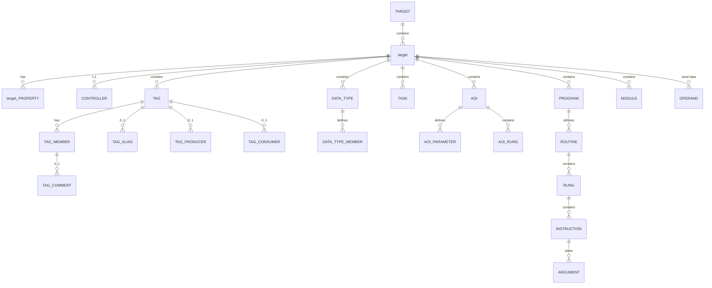

# LogixDb

An ETL tool for managing and automating ingestion of Rockwell Automation Logix Designer ACD/L5X project files
into a structured and transparent SQL database schema, enabling workflows such as project analysis, validation,
documentation, change tracking, and versioning.

## Motivation

Analyzing and extracting data from Rockwell PLC projects is often slow and manual. Without opening Studio 5000, there is
no straightforward way to centrally manage or review code across multiple projects. For system integrators and
developers, tasks like comparing configurations, validating logic versions, or bulk-extracting data remain difficult.

LogixDb was built to make PLC code analysis and data extraction developer-friendly. By parsing PLC files into a
structured SQL schema, it enables developers and controls engineers to leverage the power of SQL to write custom
queries, views, and procedures for project analysis, validation, and documentation.

## Overview

LogixDb currently offers a few tools for users to work with.

### CLI

Interactive command-line tool for managing database operations. Use it for importing L5X/ACD files, exporting targets,
and performing database maintenance. See the table below for a complete list of available commands.

| Command     | Description                                                                                        |
|-------------|----------------------------------------------------------------------------------------------------|
| **migrate** | Runs migrations to ensure the latest schema. Supports selective table creation via `--components`. |
| **import**  | Imports an L5X or ACD file as a new target into the database                                     |
| **list**    | Lists all targets, optionally filtered by target key                                             |
| **export**  | Exports a target to an L5X file by target or ID                                                  |
| **prune**   | Delete targets by ID, date, or target                                                            |
| **purge**   | Purges all data from the database while preserving the schema                                      |
| **drop**    | Drops the entire database, permanently deleting all tables and data                                |

#### Example Usage

The CLI requires a connection string using the `-c` or `--connection` option. For **SQLite**, this is a file path.
For **SQL Server**, use the format `DatabaseName@ServerHost`.

**Run migrations to ensure the latest database schema**:

```powershell
logixdb migrate -c "C:\Data\Logix.db"
```

#### Selective Component Migrations

By default, the `migrate` command creates all necessary tables for a full Logix project. However, you can use the
`--components` option to selectively create only specific sets of tables. This is useful for minimizing database size if
you only need a subset of the data (e.g., only Tags or only Logic).

The available options are defined by the `ComponentOptions` flags:

| Flag         | Value | Description                                           |
|--------------|-------|-------------------------------------------------------|
| `None`       | 0     | No component tables are created.                      |
| `Controller` | 1     | Includes all controller-related tables.               |
| `DataType`   | 2     | Includes all user-defined and system data types.      |
| `Aoi`        | 4     | Includes all Add-On Instruction (AOI) tables.         |
| `Module`     | 8     | Includes all IO and module configuration tables.      |
| `Tag`        | 16    | Includes all controller and program tags.             |
| `Logic`      | 32    | Includes all program, routine, and rung logic tables. |
| `All`        | 63    | Includes all tables (Default).                        |

**Example: Migrate only Tag and Logic tables**

You can combine flags by passing a comma-separated list or the sum of their values:

```powershell
# Using names (recommended for clarity)
logixdb migrate -c "C:\Data\Logix.db" --components "Tag, Logic"

# Using bitwise sum (16 + 32 = 48)
logixdb migrate -c "C:\Data\Logix.db" --components 48
```

**Import an L5X file (SQLite)**:

```powershell
logixdb import -c "C:\Data\Logix.db" -s "C:\Projects\MyProject.L5X" -t "PLC://Main_Controller"
```

**List all targets for a specific target (SQL Server)**:

```powershell
logixdb list -c "LogixDb@localhost" -t "PLC://Main_Controller"
```

**Export the latest target to a file**:

```powershell
logixdb export -c "LogixDb@localhost" -t "PLC://Main_Controller" -o "C:\Exports\Backup.L5X"
```

**Prune targets older than a specific date**:

```powershell
logixdb prune -c "LogixDb@localhost" --before "2024-01-01"
```

### Ingestion API Endpoint

The Windows service hosts a lightweight REST API for automated project ingestion. This allows external tools,
CI/CD pipelines, or scripts to upload PLC files to the service, which then processes and ingests them into the
configured database in the background.

#### Endpoint

| Path      | Method | Content-Type          | Description                                                     |
|-----------|--------|-----------------------|-----------------------------------------------------------------|
| `/ingest` | `POST` | `multipart/form-data` | Uploads an L5X or ACD file for background parsing and ingestion |
| `/health` | `GET`  | `application/json`    | Returns the current service status and system time              |

#### Request

The `/ingest` endpoint expects a `multipart/form-data` request with a single `file` field containing the L5X or ACD
source file.

Custom metadata can be associated with an upload by including request headers prefixed with `Logix-`. These headers
will be extracted and stored alongside the target metadata.

Example: `Logix-Target: PLC_A` or `Logix-Environment: Production`.

#### Response

Upon a successful upload, the API returns a `202 Accepted` response with the following JSON structure:

```json
{
  "traceId": "guid-of-upload",
  "received": "ProjectName.ACD",
  "status": "Queued"
}
```

#### Example Usage

Upload a file using `curl`:

```powershell
curl -X POST http://localhost:5000/ingest `
  -F "file=@C:\Projects\MyProject.acd" `
  -H "Logix-Target: MyTarget"
```

### FTAC Monitor Service

The Windows service includes an optional FTAC (FactoryTalk AssetCentre) monitoring feature. When enabled, this service
automatically monitors a FactoryTalk AssetCentre database for new versions of `.ACD` files, downloads them, and
ingests them into the configured LogixDb.

#### How it Works

1. **Polling**: The `FtacMonitorService` monitors the AssetCentre database for new asset versions.
2. **Download**: When a new version is detected, the `FtacDownloadService` retrieves the file from the database.
3. **Ingestion**: The downloaded file is placed in the configured `DropPath` and queued for background ingestion.

#### Configuration

To configure the Windows service, update the `LogixConfig` section in `appsettings.json`:

| Setting          | Type       | Default | Description                                                                                                        |
|------------------|------------|---------|--------------------------------------------------------------------------------------------------------------------|
| `DbConnection`   | `String`   | `null`  | The connection string for the LogixDb database (SQLite file path or `DatabaseName@ServerHost` for SQL Server).     |
| `DropPath`       | `String`   | `null`  | The local directory where `.L5X` or `.ACD` files are placed for background ingestion.                              |
| `AcdConverter`   | `String`   | `null`  | Path to a custom CLI tool for converting ACD to L5X. Expected contract: `convert -i <input> -o <output> --force`.  |
| `FtacMonitor`    | `Boolean`  | `false` | Enables or disables the FTAC monitoring background services.                                                       |
| `FtacConnection` | `String`   | `null`  | Optional SQL connection string override for the AssetCentre database.                                              |
| `FtacFilters`    | `String[]` | `[]`    | A list of asset name filters (wildcards supported) to limit which assets are monitored.                            |

> [!IMPORTANT]
> The service account running LogixDb must have `SELECT` and `EXECUTE` permissions on the FactoryTalk AssetCentre
> database. By default, the service assumes a local AssetCentre installation with Windows Authentication.

#### Example Configuration

```json
{
  "LogixConfig": {
    "DbConnection": "LogixDb@localhost",
    "DropPath": "C:\\ProgramData\\LogixDb\\Uploads",
    "AcdConverter": "C:\\Tools\\AcdToL5x.exe",
    "FtacMonitor": true,
    "FtacConnection": "Data Source=RemoteServer;Initial Catalog=AssetCentre;Integrated Security=SSPI;",
    "FtacFilters": [
      "Area1*",
      "Line2*",
      "!*Backup*"
    ]
  }
}
```

#### FTAC Asset Name Filtering

The `FtacFilters` configuration allows you to control which ACD files are processed from the FactoryTalk AssetCentre
database. It supports standard wildcards and both **Whitelisting** (inclusion) and **Blacklisting** (exclusion).

#### Supported Wildcards

* `*`: Matches **zero or more** characters (e.g., `*Test*` matches `Test.ACD`, `NewTest.ACD`, and `Test_Final.ACD`).
* `?`: Matches **exactly one** character (e.g., `Line?_Prog` matches `Line1_Prog` and `LineA_Prog`, but not
  `Line12_Prog`).

#### Filtering Rules

1. **Blacklists**: Any filter starting with `!` is a blacklist. If an asset name matches **any** blacklist pattern, it
   is excluded.
2. **Whitelists**: Filters without a `!` prefix are whitelists. If any whitelist patterns are defined, the asset name
   must match **at least one** of them to be included.
3. **Default**: If no filters are provided, all `.ACD` files are processed.

#### Example Filter Configurations

| Filter Pattern                                 | Description                                                                  |
|------------------------------------------------|------------------------------------------------------------------------------|
| `Area1*`                                       | Only process assets that start with "Area1"                                  |
| `Line1*`, `Line2*`, `!*Backup*`                | Process assets from Line 1 or 2, but exclude anything containing "Backup"    |
| `!Test*`, `!*TEMP.ACD`                         | Process all assets except those starting with "Test" or ending in "TEMP.ACD" |
| `Unit?.ACD`                                    | Match "Unit1.ACD" through "Unit9.ACD", but not "Unit10.ACD"                  |
| `*Main*`, `*Safety*`, `!Area51*`, `!*Sandbox*` | Include "Main" or "Safety" assets, but exclude "Area51" and "Sandbox" assets |

## Database Providers

This tool currently supports both Microsoft SQL Server and SQLite database providers.

| Provider       | Description                                                                                                                                                                                                                                                                             |
|----------------|-----------------------------------------------------------------------------------------------------------------------------------------------------------------------------------------------------------------------------------------------------------------------------------------|
| **SQLite**     | Ideal for single-developer or quick analysis scenarios. Free and open source with no additional server-side software required. Developers can quickly transform PLC projects into SQLite databases on the fly. Generated database files can be queried using any preferred client.      |
| **SQL Server** | Designed for team environments, especially those using version control systems like FTAC, Git, or SVN. Enables centralized data management and supports advanced features such as stored procedures, triggers, tSQLt, and custom tooling for enhanced collaboration and data integrity. |

This tool enables automated ingestion of L5X and ACD files into either database provider.

## ACD File Conversion

LogixDb uses the Rockwell Logix Designer SDK to convert `.ACD` files into `.L5X` so they can be parsed and
ingested. By default, the service uses the SDK on the local machine to perform this conversion. Since spinning up
a headless Studio 5000 instance to save as `.L5X` is a resource-intensive process, this task is handled by the
Windows service in the background as new files are uploaded or detected in version control.

### Custom Converter Executable

To avoid software redistribution and provide flexibility, LogixDb allows users to specify a custom command-line
executable for `.ACD` conversion. If a custom converter is specified, the service will call it instead of the default
SDK-based converter.

The custom converter must support the following CLI arguments:
`convert -i <input_path> -o <output_path> --force`

> [!NOTE]
> This capability is provided to allow users to integrate their own conversion tools and to ensure that LogixDb
> does not redistribute proprietary Rockwell Automation software.

## Installation

LogixDb is distributed as a single ZIP package containing self-contained executables for both the CLI tool and the
Windows service. No .NET runtime installation is required.

### Prerequisites

- Windows 10 or later
- PowerShell 5.1 or later (for automated installation)
- Rockwell Automation Software (Optional or use case dependent)
    - **Logix Designer / Studio 5000**: Required on the machine performing conversions if processing `.ACD` files.
    - **Rockwell Logix Designer SDK**: Used for `.ACD` file conversion by default.
    - **FactoryTalk AssetCentre**: Required if using the `FtacMonitorService` to automatically pull files from an
      AssetCentre database. This could be installed on remote machine as well.

### Setup

1. Download the latest release ZIP from [releases](https://github.com/tnunnink/LogixDb/releases)
2. Extract the ZIP to a temporary location
3. Open PowerShell as an Administrator
4. Navigate to the extracted directory
5. Unblock the PowerShell script:
   ```powershell
   Unblock-File -Path .\Setup.ps1
   ```
6. Run the installation script:
   ```powershell
   .\Setup.ps1
   ```

The setup script automates the following steps:

- **Service Deployment**: Stops any existing `LogixDb` service and deploys files to `C:\Program Files\LogixDb`.
- **SQL Permissions**: Checks for a local FactoryTalk AssetCentre database and seeds the necessary `SELECT` and`EXECUTE`
  permissions for the `NT SERVICE\LogixDb` service account.
- **Service Configuration**: Creates or updates the `LogixDb` Windows Service to run automatically.
- **System PATH**: Adds the installation directory to the system `PATH`, making the `logixdb` CLI available globally.
- **Service Startup**: Starts the `LogixDb` service to begin monitoring or hosting the Ingestion API.

> [!IMPORTANT]
> The setup script does **not** automatically migrate existing LogixDb databases. If you are upgrading or
> reinstalling, you must manually run the `logixdb migrate` command to ensure the schema is up to date
> before re-enabling or relying on the service. Check the Windows Event Viewer for errors to ensure no issues with
> database connection/validation.

### Service Management

The `LogixDb` service runs as a Windows Service. You can manage its lifecycle using the following PowerShell commands as
an Administrator:

```powershell
# View service status
Get-Service -Name LogixDb

# Restart the service (required after appsettings.json changes)
Restart-Service -Name LogixDb -Force

# View service properties and start type
Get-Service -Name LogixDb | Select-Object -Property Name, Status, StartType
```

By default, the service is installed in `C:\Program Files\LogixDb` and runs under the `NT SERVICE\LogixDb` account. If
you need to access remote network shares or specific AssetCentre instances, you may need to change the service account
via `services.msc`.

### Logging & Diagnostics

Both the CLI and the Windows Service provide detailed logging.

* **Service Logs**: The service writes events to the **Windows Event Log** under the "Application" source.
* **Verbosity**: To increase logging detail, update the `LogLevel` in `appsettings.json`:
  ```json
  "Logging": {
    "LogLevel": {
      "Default": "Debug",
      "Microsoft": "Warning"
    }
  }
  ```
* **Health Check**: You can verify the service is running by visiting `http://localhost:5000/health` in your browser.

## Database Schema

LogixDb uses a target-based relational schema to store PLC project data. This structure allows for version
tracking and historical analysis of changes across different imports of the same PLC project.

### Core Architecture

The schema is organized around three primary levels:

1. **Target**: Represents a unique asset or project (e.g., `PLC://Main_Controller`).
2. **target**: A specific version of a target, created during an `import` operation. It contains metadata about
   the import (date, user, machine) and the original source file (`source_data`).
3. **Entities**: The granular components of the Logix project (Tags, Routines, Logic, etc.) associated with a
   specific `target_id`.



### Primary Tables

| Table               | Description                                                                                    |
|---------------------|------------------------------------------------------------------------------------------------|
| `target`            | Stores unique target keys for identifying different PLC projects.                              |
| `target`          | Links an import to a target. Stores the raw source file and import metadata.                   |
| `target_property` | Key-value metadata for targets (e.g., custom headers from the Ingestion API).                |
| `controller`        | Global controller settings (name, processor type, revision, etc.).                             |
| `data_type`         | User-defined and system-defined data type definitions.                                         |
| `data_type_member`  | Individual members of a data type, including their name, data type, and dimensions.            |
| `aoi`               | Add-On Instruction definitions, including revision and creation metadata.                      |
| `aoi_parameter`     | Parameters and local tags for AOIs, including usage (Input, Output, InOut) and default values. |
| `aoi_rung`          | Rungs of ladder logic specifically defined within an AOI's logic routines.                     |
| `module`            | IO configuration and module properties (catalog number, slot, IP address).                     |
| `tag`               | All controller and program scope tags, including names, types, and descriptions.               |
| `tag_member`        | Hierarchical tag structure for UDTs and Arrays.                                                |
| `tag_comment`       | Individual member-level comments and descriptions.                                             |
| `tag_alias`         | Mapping for alias tags to their base tags.                                                     |
| `tag_producer`      | Configuration for produced tags (e.g., max consumers).                                         |
| `tag_consumer`      | Configuration for consumed tags (e.g., remote producer, connection details).                   |
| `task`              | Task metadata and execution settings (name, type, priority, rate, watchdog).                   |
| `program`           | Program-level metadata (type, main routine, fault routine, parent folder).                     |
| `routine`           | Routine metadata (name, type, container).                                                      |
| `rung`              | Individual rungs of ladder logic, including the original L5X code and rung comments.           |
| `instruction`       | Granular instruction data extracted from rungs (name, text, mnemonic key).                     |
| `argument`          | Individual instruction arguments and operands (tag name, constant value, index).               |
| `operand`           | Metadata for native Logix instructions (parameter names, types, and descriptions).             |

### Relationships

Most tables include a `target_id` column that serves as a foreign key to the `target` table. This allows you to
query all components of a specific project version using a single ID. For example, to find all tags for a specific
target:

```sql
SELECT *
FROM tag
WHERE target_id = 42;
```

### Entity Comparison & Hashing

LogixDb employs several hashing and data storage strategies to facilitate quick comparisons, change detection (diffing),
and full reconstruction of original Logix elements across different targets.

#### Record Hash (`record_hash`)

Every entity record in the database includes a `record_hash`. This hash is an **MD5 hash** of the **UTF-16 Unicode
encoded** string representation of the **hashable fields** of the database record itself (excluding internal IDs like
`target_id` or `primary_key`).

- **Purpose**: Primarily used for **diffing** and identifying if a record's data has changed between targets at a
  granular level. It allows the system to quickly detect modifications without comparing every column individually.
- **Calculation**: It is a deterministic MD5 hash of the serialized column names and values for all columns marked
  as `IsHashable` in the `TableMap`.

#### Source Hash (`source_hash`)

The `source_hash` represents the identity of the **original Logix element** as it existed in the source L5X or ACD
file.

- **Purpose**: Used to compare the state of a component in the original project file across different versions. It
  enables rapid identification of whether two entities are functionally identical at the source level, regardless of
  how they are represented in the database schema.
- **Calculation**: An **MD5 hash** of the **UTF-16 Unicode encoded** XML fragment from the source file. Generated using
  the underlying L5Sharp library's hashing algorithm on the raw XML element.

### Entity Comparison SQL Examples

The `record_hash` and `source_hash` columns enable high-performance diffing between different versions of your project.

#### Find changed tags between two targets

```sql
-- Compare target A and target B for the same target
DECLARE @targetA INT = 1;
DECLARE @targetB INT = 2;

SELECT COALESCE(a.tag_name, b.tag_name) AS TagName,
       CASE
           WHEN a.record_hash IS NULL THEN 'Added'
           WHEN b.record_hash IS NULL THEN 'Removed'
           WHEN a.record_hash <> b.record_hash THEN 'Modified'
           ELSE 'Unchanged'
           END                  AS ChangeStatus
FROM (SELECT * FROM tag WHERE target_id = @targetA) a
         FULL OUTER JOIN (SELECT * FROM tag WHERE target_id = @targetB) b ON a.Name = b.Name
WHERE ISNULL(a.record_hash, '') <> ISNULL(b.record_hash, '');
```

#### Identify source-identical logic across different PLCs

```sql
-- Find routines that have identical L5X source content across different targets
SELECT routine_name, source_hash, COUNT(*) as Occurrences
FROM routine
GROUP BY routine_name, source_hash
HAVING COUNT(*) > 1;
```

### Troubleshooting

| Issue | Probable Cause | Remedy |
| :--- | :--- | :--- |
| **FTAC Polling returns 0 assets** | Filter is too restrictive or permissions issue. | Check `FtacFilters` and ensure the service account has `SELECT` on the AC database. |
| **ACD Conversion Fails** | Studio 5000 version mismatch or licensing. | Ensure the correct version of Studio 5000 is installed and licensed on the service machine. |
| **Migration Errors** | Database file is locked or user lacks schema permissions. | Stop the service before running manual migrations; ensure the user has `db_owner` or equivalent. |
| **CLI "Target Not Found"** | Target key mismatch. | Use `logixdb list` to see existing target keys; keys are case-sensitive. |

## Feedback

Feedback, bug reports, and feature requests are welcome. Please use
the [GitHub Issues](https://github.com/tnunnink/LogixDb/issues) page to share your thoughts or report problems.

## License

This project is licensed under the MIT License. See the [LICENSE](LICENSE) file for full details.
